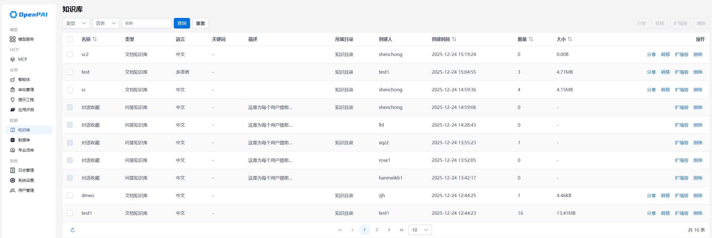
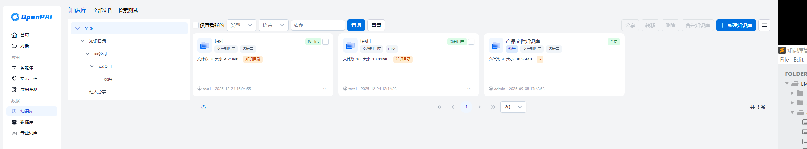

<a href="../README.md">返回</a>  

# OpenPAI 使用手册

---

本使用手册面向管理员与普通用户，帮助理解并熟练操作 OpenPAI 提供的各种功能。本手册假定你已成功安装并运行了 OpenPAI。

平台安装部署成功后，在浏览器输入平台访问地址，可打开平台的登录页。输入正确的用户名和密码后，能够访问OpenPAI的主页，体验和使用OpenPAI的各项功能。
## 1. 管理员功能

管理员（Administrator）拥有对平台的高级管理权限，可在「设置」中配置用户、模型以及全局参数，还可以管理应用、数据等。

### 1.1 平台主页
成功登录后，平台将显示 **OpenPAI** 首页，管理员可点击左侧或顶部菜单，访问「模型」、「MCP」、「应用」、「数据」、「系统」等核心模块。

### 1.2 模型服务功能
在首页可点击 **「模型服务」** 下的`模型服务`子菜单进入模型服务管理模块，

管理员可以通过“添加模型服务商”引入自己的服务商。模型添加内置多个模板，用户可以选择模板填入API-KEY进行快速添添加，也可以自行填入填入服务商名称、API-KEY以及服务URL。

如果URL能连通且支持通过OpenAI协议获取模型列表则添加时会自动将对应模型服务添加到平台，不支持则对应的模型服务列表为空。如果URL不支持获取模型列表用户可以在对应的模型服务商使用添加功能自行添加模型服务，需要填入正确的模型名称及URL。

管理员可以通过设置功能修改已经添加的模型服务商的参数，保存之后系统会重新通过URL获取模型服务列表，用户也可以通过设置-移除功能删除对应的模型服务商。服务同步功能用于获取服务商的最新的模型服务列表，如果平台保存模型服务不在服务商新的模型服务列表中则将该服务从模型服务列表中删除，如果服务商新的模型服务列表存在新的模型服务则将该模型服务添加到平台中。模型添加到平台后管理员可以通过分享功能配置模型分享范围，可以设置为全员可见或者部分用户可见，设置为部分用户可见时只有在分享范围内的用户可以使用对应模型进行对话。

### 1.3 MCP
在首页可点击 **「MCP」** 下的`MCP`子菜单，进入MCP管理模块，

### 1.4 应用
应用包括了智能体管理、审批管理、提示工程管理、应用评测任务管理等，

#### 1.4.1 智能体

在首页可点击 **「应用」** 下的`智能体`子菜单，进入智能体管理模块，

#### 1.4.2 审批管理

在首页可点击 **「应用」** 下的`审批管理`子菜单，进入审批管理模块，

#### 1.4.3 提示工程

在首页可点击 **「应用」** 下的`提示工程`子菜单，进入提示工程管理模块，

#### 1.4.4 应用评测

### 1.5 数据
数据包括了知识库、数据库、专业词库等模块，

#### 1.5.1 知识库
知识库管理是面向系统管理员开放的功能，在此模块中，管理员可以看到整个平台中所有的知识库，可以对知识库进行查询、分享、转移、扩缩容、删除。

#### 1.5.1 知识库列表
知识库列表页面展示平台所有的知识库列表。支持根据知识库类型、语言和名称进行检索查询。支持按照名称、创建时间、数量和大小进行升序和降序排列。可以对知识库进行分享、转移、扩缩容和删除操作，且都支持批量操作

#### 1.5.2 知识库分享
可以通过知识库分享操作，将知识库分享给其他用户或者用户组。

进入知识库分享页面后，可以选择分享范围和权限。每个知识库的默认范围都是【全员】，分享范围可选部分用户/全员。权限可选可查询/可查看。可查询表示该用户仅能使用该知识库，无法查看知识库里的文档内容；可查看表示该用户不仅可以使用该知识库，还可以查看知识库里的文档内容。

当分享范围选择【全员】时，表示给所有用户分享该知识库，默认权限是【可查看】，用户可以根据需求修改权限。

当分享范围选择部分用户时，表示给特定用户/用户组分享该知识库，初始分享列表为空，表示没给任何用户分享。点击【添加】按钮，在添加用户页面，展示所有用户组和当前用户所在用户组下的所有用户；用户可以给分享给用户组或者用户，权限默认是可查看，可选可查询和可查看。确认后回到分享页面，可以看到选择的用户或者用户组以及权限信息，可以移除选择的用户/用户组。在分享页面点击确认，分享操作生效。

分享支持批量操作，即可以在列表页面，选择多个知识库，点击分享按钮，进入分享页面。执行批量分享的时候，被选中的知识库原有的分享记录会被清空，以最新的分享记录为准，因此，如果要进行批量分享操作，请留意这一点。

分享操作生效后，被分享的用户/用户组成员均可以在知识库-他人分享目录下看到对应的知识库，也可以通过知识库列表查看对应的知识库，根据不同的分享权限，查看当前用户对该知识库的权限范围。

#### 1.5.3 知识库权限转移
可以通过知识库权限转移操作，将用户创建的知识库转移给其他用户，转移也支持批量操作。

进入知识库权限转移页面后，可以在用户列表选择一个用户进行转移，也可以通过名称搜索，在搜索结果里选择一位用户进行转移。

转移操作生效后，被转移的用户即可以在知识库【知识目录】下看到对应的知识库，转移功能不会影响知识库原来的分享范围，即知识库分享给其他用户后被转移，不会影响其他用户对该知识库的访问权限。

#### 1.5.4 知识库扩缩容
知识库扩缩容，可以针对单个知识库进行容量控制，默认单个知识库允许上传500个文件，管理员用户可以对不同的知识库实施不同的容量限制，容量范围是200-1000。管理员用户也可以对若干个知识库进行批量扩缩容。

#### 1.5.5 删除知识库
管理员用户可以删除除了内置知识库外的所有知识库。需要注意的是：知识库的删除操作会将知识库和知识库中文档一起删除。因此，请谨慎删除知识库。

#### 1.5.2 数据库

管理员可以通过数据库进入数据库连接管理页面。数据库连接管理界面可以查用户创建的数据库连接的列表，数据库连接列表展示连接名称、数据库类型、数据库名称、服务器地址、端口、表数量、创建人、分享范围、连接时间。用户可以通过数据库连接类型、连接名称、创建人对数据库连接进行筛选。当用户数据库表数量变更时，管理员可以通过刷新功能更新对应数据库连接的表数量。管理员可以数据库连接给其他用户，可以指定分享全部用户或者部分用户，部分用户可以分享到指定用户或者用户组，被分享用户可以在连接列表中查看、使用该连接进行数据库对话。转移功能用于将指定数据库连接转移给其他用户，转移时目标用户列表展示所有用户。转移后该数据库连接的创建人修改为新的用户。

### 1.5.3 专业词库

### 1.6 系统
系统菜单包括了`日志管理`、`系统设置`、`用户管理`等模块，

#### 1.6.1 日志管理

管理员登录后，点击页面左侧的“日志管理”进入该模块。日志列表中显示的信息包括：操作人、操作模块、操作对象、操作类型、操作结果、操作反馈信息、操作时间以及操作详情，其中操作详情包含操作前和操作后的数据。管理员可以根据操作模块、操作类型、操作结果、开始时间、结束时间、操作人等信息进行联合查询，也可以点击“重置”显示默认结果。此外，管理员可以分别对以下模块进行排序：操作模块、操作类型、操作结果以及操作时间。管理员可以根据查询的条件对查询结果进行导出，最多导出1000条数据，导出的数据为.csv格式的文件。

#### 1.6.2 系统设置
系统设置包含了业务配置和页面配置两个tab页，业务配置主要是对系统中各个业务模块进行基础业务配置以更好的分配系统资源，合理使用系统能力。
##### 业务配置

##### 页面配置
页面配置主要是对系统进行灵活配置，以满足各个系统的个性化需求。页面配置主要是对浏览器标题栏名称、产品logo、主页logo等进行配置，可以进行修改或重置。

#### 1.6.3 用户管理

---
## 2. 普通用户功能

普通用户登录成功后，可在系统中进行智能体的概览查看、对话的交互等，也可以自行进行智能体的管理、提示工程的管理，还可以对各个应用进行评测，同时，用户还可以对各种数据进行管理，主要是知识库、数据库、专业词库的管理。对于系统的使用，用户可以进行系统设置，以满足自身偏好需求。

### 2.1 首页

### 2.2 对话功能

 **「对话」** 页面，体验大模型、智能体、数据库交互。用户可以选择与大模型对话、与智能体对话、与数据库对话，并管理对话信息。

#### 2.1.1 新建对话

点击 **「新建对话」**，系统将打开一个全新的对话窗口。用户可以：
- 快速进入对话模式

打开新建对话的页面，用户可以看到要交互的对象，比如模型、智能体或者是某个数据库，如果不存在智能体，可以在「智能体」模块下创建智能体；如果未选择数据库或者未创建数据库，可以预先在「数据库」模块下创建数据库信息。

- 浏览交互对象的基本信息

对于不同的交互对象，显示不同的信息，如果与大模型进行对话则显示的是模型信息，并可以对模型参数进行修改；如果与智能体进行对话，则显示智能体信息；类似的数据库对话，显示数据库连接信息，供用户选择。

- 多样化对话交互，获取问答结果

用户可以发送问题，并等待系统回复，回复内容以流式输出。系统支持上传多种格式的文件、音频、图片，并针对其进行问答交互。

- 设置交互细节，获取精准、定制化交互

用户可以更改模型参数、选择工具（内容安全审核、全网搜索、知识库问答等）进行更细致精确的回复。

#### 2.1.2 管理对话

- 对话的增删改查，系统支持对话查询、更改名称、删除对话等操作
- 复制对话，对于某个对话，可以复制一个新的对话，包含当前对话的所有配置信息，而不含交互历史
- 导出对话记录，对于对话交互历史，可以导出为markdown格式的文件到本地

#### 2.1.3 管理对话内容

- 复制内容：用户可以快捷复制问题或答案
- 引用内容：可以引用之前的内容并做继续问答
- 重新生成对话，用户可以对某个对话进行内容重新生成
- 删除问答对：用户可以将多个问答对进行删除，不再展示
- 收藏：收藏问答对到知识库模块
- 用户评价回答质量：支持用户对回答结果做评价，点赞或点踩

### 2.3 智能体管理

#### 2.3.1 智能体

#### 2.3.2 工作流

#### 2.3.3 工具

工具界面展示当前用户在智能体或工作流中可以使用的工具汇总。

用户可以：

- 新增工具（以**API**的形式接入）
- 删除工具
- 编辑工具

### 2.4 提示工程管理

### 2.5 应用评测

### 2.6 知识库管理

知识库，可对大模型推理进行知识检索增强（RAG），用户点击左侧【知识库】导航目录进入到知识库页面，可以在此页面建立和管理自己的知识库，知识库中可以上传文档，对不同格式的文档进行统一处理，便于用户管理自己的知识文件。目前知识库菜单下包含【知识库】、【全部文档】和【检索测试】三个tab页。

#### 2.6.1 知识库目录管理
这里知识库引入了目录层级的概念，用户可以创建不同层级的目录，在不同层级的目录下创建知识库。在知识库tab页中，左侧是知识库目录树结构。 
 
##### 2.6.1.1 目录列表
顶级目录为【全部】，下分2个根目录【他人分享】和【知识目录】。顾名思义，【他人分享】目录下存放的是其他用户分享或者公开的知识库，【知识目录】下存放的是当前用户自建的知识库。
 
##### 2.6.1.2 目录创建
当前支持在【知识目录】下创建子目录，默认支持创建7层子目录，每个目录下同级目录不超过100个，默认参数可以通过管理员账户在系统设置中修改。【他人分享】目录下不支持创建子目录。
 
##### 2.6.1.3 目录修改
用户可以修改【知识目录】下创建的子目录，可以修改目录名称和所属目录，修改所属目录即可达到移动目录的效果。根目录不支持修改。
 
##### 2.6.1.4 目录删除
用户可以删除【知识目录】下创建的子目录，当目录下有子目录时，不允许删除；当目录下存在知识库时，删除目录后，知识库所属目录默认上移一层。根目录下不支持删除。

#### 2.6.2 知识库管理

##### 2.6.2.1 知识库列表
该UI界面展示用户可以查看的所有的知识库列表，包括自己创建的、分享给自己的以及公开的文档知识库和问答知识库；每个知识库展示的信息包括：名称、类型、语言、关键词、描述、所属目录、分享范围、权限、创建人、创建时间、数量、大小、操作；支持根据知识库类型、语言和名称进行检索查询。知识库类型包含文档知识库和问答知识库两种类型；知识库语言包含中文、中英、日文、韩文、多语言五种类型。

在列表视图界面，支持按照名称、创建时间、数量和大小进行升序和降序排列。可以对知识库进行分享、转移、删除和合并操作，且都支持批量操作。

##### 2.6.2.2 内置知识库
每个用户都有一个名为【问答收藏】的内置知识库，在普通对话页面，选择某个对话，点击模型回答下方的收藏按钮，即会同步到问答收藏知识库。此知识库不支持修改名称、也不支持分享、转移、删除、合并操作。

对话收藏知识库中，只允许从对话页面收藏同步问答对到知识库中，没有上传文档解析功能，也不允许用户手工添加问答对。
 
同时，在他人分享页面，有一个全员共享的名为【产品文档知识库】的内置知识库。普通用户可以直接使用这个知识库进行问答测试，也可以在智能体中基于知识库智能问答模板进行问答，模板默认使用知识库的为【产品文档知识库】。需注意，这是一个内置知识库，此知识库不支持修改名称、也不支持分享、转移、删除、合并操作。

##### 2.6.2.3 新建知识库
点击“新建知识库”按钮，进入知识库创建界面，填写信息如下：

选择知识库类别，【文档知识库】或【问答知识库】

填写知识库的名称，知识库的名称按照UI上提示符合规范即可，且可以后期修改，同一个用户下的知识库名称不能重复

选择知识库语言，语言选项为文档内容所属的主要语言，默认选择中文，可选中文、中英、日文、韩文、多语言；需要注意的是：不同语言的知识库对应的编码模型不同，若设置完语言后，上传的文档语言和知识库语言不一致，解析会失败。知识库语言设置后，不可修改，请注意。

填写知识库描述，非必填，可为空。

选择所属目录。

填写知识库关键词，可以为空。

点击“完成创建”回到卡片列表页面，点击“创建并上传文件”会直接回到上传文档的页面。

##### 2.6.2.4 编辑知识库

在知识库列表页或者知识库卡片页，可以点击【编辑】按钮进入知识库编辑页面。编辑页面可以修改名称、描述、所属目录和关键词信息。

##### 2.6.2.5 知识库配置

点击知识库，进入知识库详情页面。

文档知识库有2个标签页：文件管理、配置；

问答知识库有3个标签页：文件管理、问题列表、配置；

点击配置标签页，可以对知识库的解析、分块、入库、检索进行编辑。

（1）知识库解析配置

语言检测：开启此按钮，后台会校验解析文档的语言是否与知识库语言配置一致；如果不一致，会解析失败，提示报错；选择关闭时，后台不再校验解析文档的语言，直接使用知识库设置的语言进行处理。需要注意的时，当进行pdf文件解析时，只有选择“精度优先策略”时该配置才生效。当选择“速度优先策略”或“视觉语言模型”时，该配置没有作用。

解析策略：PDF文件解析分为“精度优先策略”、“速度优先策略”、“视觉语言模型”三种解析策略，解析时只能三选一，默认为“精度优先策略”；另外，在PDF解析之后仍可修改该配置。

- 1）选择“精度优先策略”时，后台调用布局检测、公式识别检测、表格识别、文字识别等流水线组件进行pdf解析，精度高，通用性强，在gpu部署时解析速度更快；选择该配置时，有两个点选子配置项：“影印版”和“公式识别”。
开启“影印版”按钮，后台是使用OCR模型进行文字识别，建议影印版pdf点选此配置；关闭“影印版”按钮时，后台会自动判断pdf文档是否是影印版，如果非影印pdf，则会使用python库函数直接抽取pdf中的文字，解析速度会更快。但是，自动判断pdf文档是否是影印版有误差，如果确定是影印版pdf，建议直接点选此按钮。默认关闭此配置。
开启“公式识别”按钮，后台会调用公式检测模型来检测pdf文件中是否有公式。有公式的pdf文件，或者不确定是否有公式，建议点选此按钮。如果确定pdf中没有公式，则关闭该配置项，关闭时会提高解析速度。默认开启此配置。
 
- 2）选择“速度优先策略”时，后台调用规模更小的布局检测、文字识别等模型进行解析，精度稍差，但是在cpu部署时解析速度会更快；选择该配置时，有一个点选子配置项：“影印版”。
开启“影印版”按钮，后台是使用OCR模型进行文字识别，建议影印版pdf点选此配置；关闭“影印版”按钮时，后台会使用python库函数直接抽取pdf中的文字，解析速度会更快。如果确定是影印版pdf，建议直接点选此按钮。默认关闭此配置。
 
- 3）选择“视觉语言模型”时，后台调用视觉语言模型进行pdf解析，解析精度更高，可处理格式复杂、多种语言(中、英、日、韩)混杂等问题的pdf文档，但是所需资源更多，解析速度稍慢，建议gpu部署时使用；
图片理解：开启此配置，则会使用AI模型精确理解图片内容，这一步会耗费更长时间。

（2）知识库分块配置

分块策略包括通用分块和多级分块，默认使用通用分块。

- 通用分块：系统按照用户自定义的规则将内容拆分为独立的分块。当问答检索匹配到某一分块时，直接返回该分块的内容作为上下文。

该配置只有一个参数：

    - 分块的大小：将长文本切分成多个分块后，分块token的数量限制；取值范围0-1000，默认128。
 
- 多级分块：多级分块模式采用双层分块结构来平衡检索的精确度和上下文信息的完整度，问答时使用二级分块检索，但是返回一级分块内容，可提供丰富的上下文信息。

该配置有2个参数：

    - 二级分块大小：在保证语义完整性的前提下，根据设定的分块tokens数量切分文档；取值范围0-1000，默认128。
    - 一级分块大小：一级分块的字符数量限制。每个一级分块包含多个二级分块；问答时使用二级分块检索，但是会返回其所在的一级分块内容；取值范围512-4096，默认1024。
 
（3）知识库入库配置

- 入库参数：编码模型（嵌入式模型）

    注意：该内容只有文档未解析的时候才允许修改，如若已有解析成功的文档或者正在排队的文档，该入库参数不能修改。

编码模型可以任选其一： bce-embedding-base_v1、bge-m3、Yuan-embedding-1.0，可以根据文档内容的需要，选择合适的编码模型。

    - bce-embedding-base_v1，擅长中英双语和跨语种语义表征能力，向量维度768。bce-embedding是由网易有道翻译发布的一款开源模型，针对不同领域如教育、法律、金融、医疗等的RAG场景做了专门优化。
    - bge-m3，由北京智源人工智能研究院发布，支持中、英、日、韩等多种语言，在多语言、跨语言的表征和检索方面能力优秀，最高支持8192长度的输入文本，向量维度1024。
    - Yuan-embedding-1.0，是由浪潮信息发布的，专为增强中文文本检索能力而设计的嵌入模型，默认向量维度为1792，在医疗、新闻、百科等多个领域表现良好，相对于其他同规模的模型，往往具有更好的检索精度和召回率。

（4）知识库检索配置

检索参数：包括：引用数量、检索类型（混合检索、关键词检索、向量检索）、各个检索类型的推荐权重、相似度阈值。

混合检索：使用关键词查询和向量查询两种方式进行查询，即多路召回，并将查询的结果和查询的问题，使用相关性算法进行分析，根据相关度从高到底进行排序；

关键词检索：也称为全文检索，仅基于关键词进行匹配查询。使用关键词提取算法分别提取知识段落、用户问题中的关键词，然后根据关键词进行检索。

向量检索：通过分析用户问题的语义向量，从知识库中查询语义相关的知识段落。 可以理解查询内容的语义，进行相似性查询，可以支持多模态查询，且有很强的容错性。

    注意：当知识库语言不同时，相对应地，检索策略也不同：中文、中英：默认混合检索，可以选择其他检索方式。日文、韩文、多语言：默认向量检索，且不可更改。具体参数说明见“检索测试”章节。

##### 2.6.2.6 删除知识库
知识库的删除操作会将知识库和知识库中文档一起删除。用户只能删除自己创建的知识库，对于分享给自己的以及对其公开的知识库没有删除权限。
 

##### 2.6.2.7 知识库分享
可以通过知识库分享操作，将用户创建的知识库分享给其他用户或者用户组，可以给不同的用户或者用户组赋予不同的权限。普通用户知识库分享入口有两个：一个是知识库卡片页，选择某个知识库，点击知识库操作下拉选项，有个分享按钮，点击【分享】按钮进入知识库分享页面；另一个是在知识库列表页面，知识库操作列有个分享按钮，点击【分享】按钮进入知识库分享页面。管理员用户在知识库页面也可对所有知识库进行分享操作。

进入知识库分享页面后，可以选择分享范围和权限。每个知识库的默认范围都是【仅自己】，分享范围可选仅自己/部分用户/全员。权限可选可查询/可查看。可查询表示该用户仅能使用该知识库，无法查看知识库里的文档内容；可查看表示该用户不仅可以使用该知识库，还可以查看知识库里的文档内容。

当分享范围选择【仅自己】时，表示不分享给其他用户，知识库创建者拥有该知识库的所有权限。

当分享范围选择【全员】时，表示给所有用户分享该知识库，默认权限是【可查看】，用户可以根据需求修改权限。

当分享范围选择部分用户时，表示给特定用户/用户组分享该知识库，初始分享列表为空，表示没给任何用户分享。点击【添加】按钮，在添加用户页面，展示所有用户组和当前用户所在用户组下的所有用户；用户可以给分享给用户组或者用户，权限默认是可查看，可选可查询和可查看。确认后回到分享页面，可以看到选择的用户或者用户组以及权限信息，可以移除选择的用户/用户组。在分享页面点击确认，分享操作生效。

分享支持批量操作，即可以在列表页面，选择多个知识库，点击分享按钮，进入分享页面。执行批量分享的时候，被选中的知识库原有的分享记录会被清空，以最新的分享记录为准，因此，如果要进行批量分享操作，请留意这一点。 

分享操作生效后，被分享的用户/用户组成员均可以在知识库-他人分享目录下看到对应的知识库，也可以通过知识库列表查看对应的知识库，根据不同的分享权限，查看当前用户对该知识库的权限范围。

##### 2.6.2.8 知识库权限转移
可以通过知识库权限转移操作，将用户创建的知识库转移给其他用户。普通用户知识库权限转移入口和知识库分享入口类似，具体可以参照【知识库分享】相关章节。

进入知识库权限转移页面后，可以选择转移给组成员或者指定用户。

选择组成员时，可以从组成员列表中选择一位用户进行转移。

选择指定用户时，直接输入用户名，系统会校验输入的用户名是否存在，是否可以转移。

转移支持批量操作，即可以在列表页面，选择多个知识库，点击转移按钮，进入转移页面。 

转移操作生效后，被转移的用户即可以在知识库【知识目录】下看到对应的知识库，转移功能不会影响知识库原来的分享范围，即知识库分享给其他用户后被转移，不会影响其他用户对该知识库的访问权限。

##### 2.6.2.9 合并知识库
用户可以选中两个以上自己创建的相同类型的知识库进行合并，合并时需要设置新知识库名称、语言、所属目录，可以输入关键词及描述，合并后的新知识库其他配置与第一个选中的知识库相同。新知识库会导入原被合并知识库的文档，如果原知识库中文档已经解析或者待解析，新知识库中对应的文档加入到解析队列中，否则为未解析状态。被合并的原知识库信息及文档不变。

##### 2.6.2.10 拆分知识库
用户可以选中知识库中的文件进行知识库拆分，拆分时需要设置新知识库名称、语言、所属目录，可以输入关键词及描述，拆分的新知识库其他配置与原知识库相同。被选中的文档会导入到新知识库中，如果原知识库中文档已经解析或者待解析，新知识库中对应的文档加入到解析队列中，否则为未解析状态。被拆分的原知识库信息及文档不变。

#### 2.6.3 文档管理
##### 2.6.3.1 上传文档
当创建的是【文档知识库】时，点击知识库进入知识库详情界面，有2个标签页，分别是文件管理和配置界面。点击文件管理标签页，可以上传文档，目前支持pdf、docx、doc、txt、html、htm、md、json、jsonl、epub、mobi、xml、pptx、chm、xlsx、jpeg、jpg、png格式的文档。单次上传，文档大小不超过500MB，最多200个。上传过程中可以查看上传进度。单个知识库默认容量是500个文档，容量限制可以通过管理员在系统设置页面进行修改。

支持在导入文档页面勾选【导入完成自动开始解析】，默认处于勾选状态，即文档上传成功后，立即解析，无需用户在文档管理页面手工点击解析触发。
    
    【注意】：文件名长度不能超过80个字符，否则解析有可能报错。

支持本地文件导入和指定服务器SFTP导入两种方式。

###### 2.6.3.1.1 本地文件导入
本地文件导入支持导入支持选择多个文件和选择文件夹的方式导入。这里以【文档知识库】为例，进行说明：
 
###### 2.6.3.1.2 指定服务器SFTP导入
指定服务器SFTP导入方式，需要用户填写服务器地址、端口、文件目录，鉴权方式等信息。其中鉴权方式又包括用户名+密码和用户名+秘钥两种方式。 

SFPT导入后，会在后台进行文档上传操作，可以在文档管理页面，看到后台任务。

点击查看后，进入任务详情页，展示任务编号、服务器地址、端口、文件目录、文件总数、任务进度、已导入文件数、任务状态、当前正在导入的文件等信息。

任务完成后，进度100%，状态也同步更新。

当创建的是【文档知识库】时，点击知识库进入知识库详情界面，有2个标签页，分别是文件管理和配置界面。点击文件管理标签页，可以上传文档，目前支持pdf、docx、doc、txt、html、htm、md、json、jsonl、epub、mobi、xml、pptx、chm、xlsx、jpeg、jpg、png格式

当创建的是【问答知识库】时，点击知识库进入知识库详情界面，有3个标签页，分别是文件管理、问题列表和配置界面。点击文件管理标签页，可以上传文档，目前支持xlsx、csv格式的文档，单次上传，文档大小不超过500MB，最多200个。【问答知识库】导入文档页面支持模板下载，需参照模板进行文件编辑后再上传，上传过程中可以查看上传进度：

【模板下载】下载的是一个faq_template.csv格式的文档，里边包含两列：问题列和答案列，用户使用问答知识库文档解析时，需按照这个模板的格式构造自己的文档，必须包含问题和答案两列，否则解析失败。

##### 2.6.3.2 文件管理
当创建的是【文档知识库】时，在列表视图界面，支持按照名称、文件大小和更新时间进行升序和降序排列。支持根据名称和文档状态进行过滤查询。

当创建的是【问答知识库】时，在列表视图界面，支持按照文档名称、文档大小和更新时间进行升序和降序排列。支持根据名称和文档状态进行过滤查询。页面上包含拆分知识库、解析、取消解析、删除以及导入文档等功能。

##### 2.6.3.3 文档解析
文档解析是指文档中的具体内容进行解析，抽取出文字并对其进行分块,文本分块（chunk）也可称为“知识”。这样就形成了知识库-文档-知识三层的知识体系。

文档上传成功后，支持解析全部文件和解析选中文件；支持批量取消解析。解析过程中会看到排队的现象，如果解析失败，状态中会展示失败原因；解析失败的文档可以进行二次解析，但是解析成功的文档不允许再次解析，避免对平台的资源浪费。

##### 2.6.3.4 解析结果查看
知识库文档解析成功后，点击【解析结果】进入解析结果查看界面，解析结果分页展示，如下：

点击缩略图，可以查看分块内容在源文件的内容；

点击每个分块内容，可以定位到在源文件的页码数，方便用户进行查看；

解析完成后，文档将根据所在知识库的配置参数，自动完成知识编码和数据库存储。

##### 2.6.3.5 解析结果操作
解析结果操作包括：

- 知识块的启用禁用，禁用的知识块不会出现在检索结果中；
- 知识块的编辑，用户可以修改知识块的文本内容；
- 批量操作，批量的启用、禁用、删除知识块；
- 新增知识块，用户可以新增知识块到该文档中，用于知识库的检索；
- 全部替换，如果解析结果部分内容不准确，用户可以使用全部替换功能，替换解析块中的所有不准确部分的内容，【原内容】长度限制1-100字符；【替换为】长度限制0-100字符。

##### 2.6.3.6 问题列表-问答知识库
进入问答知识库详情界面，有3个标签页，分别是文件管理、问题列表和配置界面。点击【问题列表】标签页，可以展示该知识库下所有问题信息，包括：问题、答案、所属文档、字符数、更新时间。

可以通过问题、字符数、更新时间进行升序降序排列。支持对每个问题进行修改；支持新增问题；支持批量删除问题。

点击编辑按钮，可以修改问题和答案，其中，问题长度限制1-100字符；答案长度限制1-1000字符。

#### 2.6.4 全部文档
##### 2.6.4.1 文档列表
普通用户点击【知识库】菜单栏，进入知识库页面，点击【全部文档】tab页，可以展示该用户创建的所有知识库和文档对话中上传的文档，同时也包含公开的知识库的文档。列表展示包含名称、上传时间、文档大小、创建人、来源、状态、分块数、操作等信息。可以根据名称、上传时间、创建人进行升序降序排列。可以根据名称进行查询，并通过状态进行过滤。可以勾选【仅查看我的】，点击查询按钮，过滤用户自己上传的文档。操作列可以对用户自己的文档进行删除，支持批量删除操作。

##### 2.6.4.2 引用跳转
点击某个文档，有个下拉菜单，可以显示该文档在对话中的引用信息，单击某一条具体记录，可以跳转到对应对话的引用位置。

#### 2.6.5 检索测试
##### 2.6.5.1 检索测试
普通用户点击【知识库】菜单栏，进入知识库页面，点击【检索测试】tab页，可以从检索范围中选择用户自己创建的、且内容不为空（必须包含有解析完成的文档或者有手工添加问答对）的知识库；可以在检索设置中设置检索策略、引用数量和相似度阈值。可以对选中的知识库中的文档进行检索测试，快速的验证文档分块和检索效果：选择合适的检索策略（混合检索、关键词检索、向量检索）、设置权重，设置合适的相似度阈值，添加测试文本，即可从知识库中检索出相关度最高的若干个文本块； 

检索结果展示的内容包括：文档名称、页码、相似度、语义相似度、关键词相似度内容缩略图、内容文本；

在检索结果中，如果用户想对文本块进行修改，可以点击文本块后的【编辑】按钮进行编辑，更新后的结果会同步到知识库的文本块列表中。

测试完毕后，用户如果觉得检索参数比较合适，可以点击【同步】按钮，将该配置信息保存到对应知识库的配置中。

检索过程分为两个阶段：粗排阶段和精排阶段。

粗排阶段主要是剔除不符合条件的文本，返回第一阶段的检索结果；在精排阶段，会根据粗排的结果做进一步的相似度计算，得出符合条件的文本结果。

- 引用数量：表示最终召回结果，混合相似度得分排名最高的前N个文本。
- 检索类型：包括【混合检索】【关键词检索】【向量检索】三种类型，不同的类型对应有一些额外参数。
    
  【混合检索】：综合关键词相似度和向量余弦相似度，关键词相似度权重默认为 0.2。混合相似性评分=α关键词相似度得分+(1-α)语义相似度得分。 

  【关键词检索】：仅使用关键词相似度，关键词相似度权重均默认为 1，用户无感知。

  【向量检索】：仅使用向量余弦相似度，关键词相似度权重均默认为 0，用户无感知。
- 混合相似度阈值：使用混合相似度得分来评估两段文本之间的距离。它是加权关键词相似度和向量余弦相似度的综合结果。如果查询和块之间的相似度小于此阈值，则该块将被过滤掉。混合相似度阈值默认为0.5 。

- 关键词相似度权重：关键词相似度权重取值范围是[0,1]，关键词相似度权重和语义(向量)相似度权重总和为1.0。这里使用【关键词】和【语义】分别表示关键词相似度权重和向量相似度权重。

    > 注意：如果不确定，则使用默认参数即可。 

用户可根据实际情况进行参数调整。以下是参数调整的场景：
1. 当待检索的文本中包含大量相似性文本时，可以适当提高【混合相似度阈值】，以检索出相似度更高的文本段。
2. 当用户更希望使用关键词过滤文本时，可以直接使用【关键词检索】；相反，当用户更希望使用语义去检索文本时，可以直接使用【向量检索】。
3. 当用户的问题中与文档内容更多的是关键词联系，即关键词少且精，用户可以提高【关键词相似度权重】，或者尝试使用【关键词检索】。
4. 当用户的问题和文档内容很明显没有关键词联系，但是有意思相近的部分，则尽量使用【向量检索】，或者降低【关键词相似度权重】。
5. 当知识库设置的语言是日文或者韩文时，默认使用【向量检索】，且不可更改。

### 2.7 数据库管理

数据库连接管理界面可以查看自己创建或者他人分享数据库连接的列表，数据库连接列表展示连接名称、数据库类型、数据库名称、服务器地址、端口、创建人、分享范围、连接时间。用户可以通过数据库仅查看我的、连接类型、连接名称、创建人对数据库连接进行筛选。

用户可以通过创建数据库连接功能添加数据库连接，用户需要选择数据库类型（支持的数据库类型MySQL、PostgreSQL、MariaDB、SQL Server、Oracle、Dameng），填入连接名称、服务器地址、端口、用户名、密码、数据库名称。确认后系统会使用数据库类型、服务器地址、端口、用户名、密码、数据库名称进行连接测试，如果数据库连接失败则创建失败，连接成功则创建成功，创建后平台会自动读取数据库的表信息。刷新列表可以查看新创建的数据库连接。

当用户数据库表数量变更时，用户可以通过刷新功能更新对应数据库连接的表数量。数据库创建者可以数据库连接给其他用户，可以指定分享全部用户或者部分用户，部分用户可以分享到指定用户或者用户组，被分享用户可以在连接列表中查看、使用该连接进行数据库对话。转移功能用于将指定数据库连接转移给其他用户，转移时目标用户列表展示所有用户。转移后该数据库连接的创建人修改为新的用户。

AI学习库信息AI学习库中的数据用于对话时给大模型提供提示词，可以提高大模型答复的准确率。用户可以查看该数据库对应的学习库数据，并可以通过添加功能将添加自己的学习数据。AI学习库数据包括三种类型：SQL问答、专业术语、DDL语法。SQL问答包括问题描述及该问题对应的SQL答案；专业术语为描述该数据库信息的描述语言可以填入数据库结构、用途等相关信息；DDL语法为数据库中数据表创建或修改的SQL语句，在数据库添加时系统会读取数据库中表的创建语句并添加到学习库中，用户可以对此部分数据进行删除或添加。

### 2.8 专业词库管理

### 2.9 偏好设置

用户可以进行系统语言的设置，可选项目前支持中文和英文；同时还支持系统主题的展示，比如明亮/暗黑模式等；系统使用需要满足用户协议，可以从此处查看。

---

## 3. 常见问题与支持

1. **无法登录**：请先确认已在系统中创建账号，并输入正确的用户名和密码。
2. **没有可用模型**：可能尚未配置模型，或模型被设为「私有」。请联系管理员。

如有更多技术问题，请联系运维团队或管理员。

---

## 4. 版本迭代与更新

未来版本中，我们将持续优化：
- **更多模型支持**：与更多公有云或企业自研模型连接。
- **插件生态**：进一步完善知识库、文档管理、自动化工作流等功能。
- **用户体验**：加强对话体验，提供多轮上下文管理、多语言支持。

 

---

## OpenPAI，让大模型应用开发更轻松、更高效！
